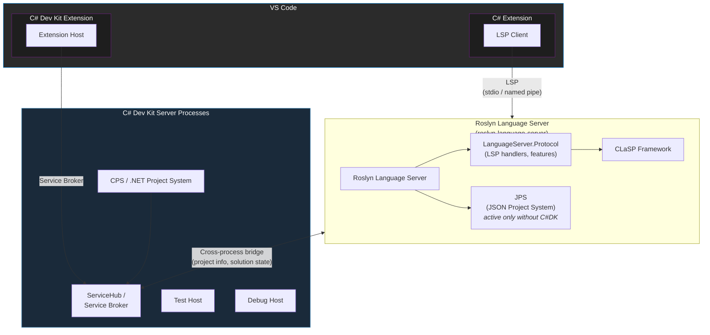
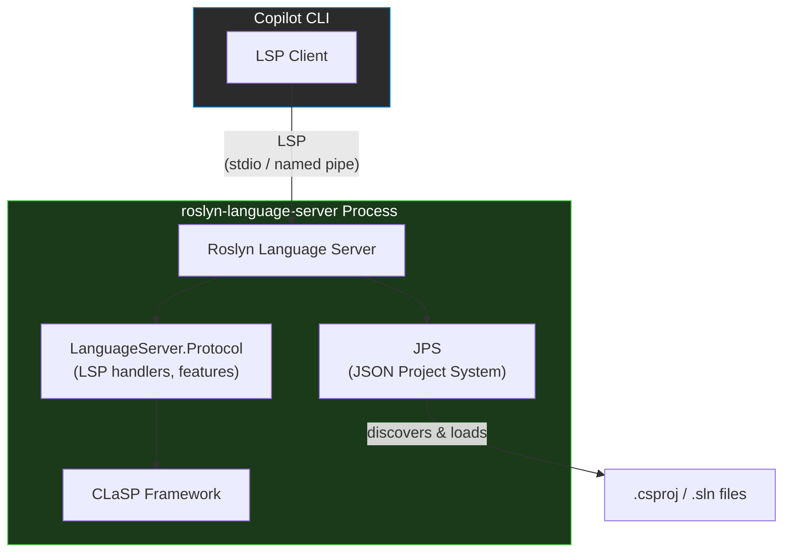

# 术语表：C# 语言服务器生态系统

C# 语言服务器生态系统中常用术语、缩写词和组件的参考手册。

---

## 协议与标准

| 术语 | 定义 |
|------|------|
| **LSP**（语言服务器协议，Language Server Protocol） | 基于 JSON-RPC 的协议规范，定义了编辑器（客户端）与语言服务器之间的通信方式。规定了补全、诊断、跳转到定义等功能所需的类型、方法和生命周期。规范：https://microsoft.github.io/language-server-protocol/ |
| **JSON-RPC** | 作为 LSP 传输层的远程过程调用协议。消息以 JSON 格式编码，通过 stdio、命名管道或其他传输方式发送。 |
| **自定义 LSP 消息** | LSP 允许服务器和客户端在标准规范之外定义自定义请求和通知方法。Roslyn 使用带有 `roslyn/` 前缀的自定义消息来支持标准协议未涵盖的功能，例如代码操作解析、项目诊断和源生成器支持。 |
| **VS LSP 扩展** | Visual Studio 通过附加的协议方法和类型（前缀为 `vs/` 或 `_vs_`）扩展了 LSP，以支持标准 LSP 规范未覆盖的更丰富的 IDE 功能，例如文档高亮、项目上下文、图标映射和富诊断。当 Roslyn 语言服务器在 Visual Studio 内部运行时，这些扩展可用，并可通过能力协商启用。 |

## 语言服务器

| 术语 | 定义 |
|------|------|
| **Roslyn 语言服务器（RLS）** | 独立的 Roslyn 驱动语言服务器可执行文件（`roslyn-language-server`）。构建自 `src/LanguageServer/Microsoft.CodeAnalysis.LanguageServer/`，通过 LSP 提供 C#（及 VB）语言功能。既可用于 C# 扩展，也可作为独立工具使用。也称为"Roslyn LS"。 |
| **OmniSharp（O#）** | 早于 Roslyn 语言服务器出现的社区驱动开源 C# 语言服务器。可作为独立服务器进程运行（不限于 VS Code），同时支持标准 LSP 协议和其自有的 OmniSharp 协议。曾是 C# VS Code 扩展的核心。仓库：[OmniSharp/omnisharp-roslyn](https://github.com/OmniSharp/omnisharp-roslyn)。 |

## Roslyn LSP 架构

| 术语 | 定义 |
|------|------|
| **Microsoft.CodeAnalysis.LanguageServer** | 托管独立语言服务器可执行文件（`roslyn-language-server`）的项目。引用 LanguageServer.Protocol 并将其打包为可运行的 .NET 工具，通过 stdio 或命名管道进行通信。被 C# VS Code 扩展（以子进程方式启动）使用，也可通过 `dotnet tool install` 作为 CLI 工具使用。包含 JPS（但可停用）。位于 `src/LanguageServer/Microsoft.CodeAnalysis.LanguageServer/`。 |
| **Microsoft.CodeAnalysis.LanguageServer.Protocol** | 所有 Roslyn LSP 场景共用的 LSP 实现库。包含 LSP 请求处理程序、协议类型定义、工作区集成和功能布线。该项目同时被独立语言服务器可执行文件和 Visual Studio 进程内 LSP 服务器所引用，为 Roslyn 的语言功能提供统一的 LSP 实现。位于 `src/LanguageServer/Protocol/`。 |
| **CLaSP**（通用语言服务器协议框架，Common Language Server Protocol Framework） | Roslyn 为创建 LSP 服务器实现而构建的框架。提供基类（`AbstractLanguageServer`、`IRequestHandler`、`IRequestContextFactory` 等）和请求队列管理。位于 `src/LanguageServer/Microsoft.CommonLanguageServerProtocol.Framework/`。 |
| **Roslyn LSP 协议类型** | LSP 协议消息的 C# 类型定义，与 Razor 和 XAML 共享。位于 `src/LanguageServer/Protocol/Protocol/`。 |

## 项目系统

| 术语 | 定义 |
|------|------|
| **CPS**（通用项目系统，Common Project System）/ **.NET 项目系统** | C# Dev Kit 和 Visual Studio 使用的项目系统。提供完整的基于 MSBuild 的项目求值和设计时构建。在 VSCode 中由 C# Dev Kit 扩展托管和提供。与 C# 扩展中的 RLS 跨进程通信。 |
| **JPS**（Jason 项目系统，Jason Project System） | 当 Roslyn 语言服务器未连接到 C# Dev Kit 时使用的轻量级项目系统（即仅使用 C# 扩展或 CLI 场景）。提供项目发现和加载功能。 |

## VSCode 扩展

| 术语 | 定义 |
|------|------|
| **C# 扩展（独立模式）** | 未安装 C# Dev Kit 时运行的 [C# for Visual Studio Code](https://marketplace.visualstudio.com/items?itemName=ms-dotnettools.csharp) 扩展。使用 Roslyn 语言服务器（RLS）提供语言功能，使用 Jason 项目系统（JPS）加载项目。 |
| **C# Dev Kit（C#DK）** | [C# Dev Kit](https://marketplace.visualstudio.com/items?itemName=ms-dotnettools.csdevkit) VS Code 扩展。托管独立进程，在 C# 扩展之上增加了解决方案管理、测试资源管理器和更丰富的项目系统支持。 |
| **C# + C# Dev Kit** | 在 VS Code 中同时安装 C# 扩展和 C# Dev Kit 扩展的组合。在此场景中，Roslyn 语言服务器通过跨进程桥接连接到 C# Dev Kit 的 ServiceHub 服务器。JPS 被停用，CPS 通过该桥接为 Roslyn 语言服务器提供项目信息。 |

## 架构图

> **仅安装 C# 扩展**（未安装 C# Dev Kit）：只有右侧部分处于活动状态——C# 扩展启动 RLS，RLS 使用 JPS 进行项目加载。C# Dev Kit 扩展及其 ServiceHub 进程不存在。
>
> **C# + C# Dev Kit**：两个扩展均处于活动状态。C# Dev Kit 启动托管 CPS 和其他服务的 ServiceHub 进程。RLS 通过跨进程桥接连接到 ServiceHub，JPS 被停用，CPS 通过该桥接为 RLS 提供项目信息。

## 独立工具架构

> **独立使用方式**：`roslyn-language-server` 可作为 .NET 工具安装（`dotnet tool install --global roslyn-language-server`）。它以单进程运行，使用 JPS 进行项目发现，并通过 stdio 或命名管道进行通信。
