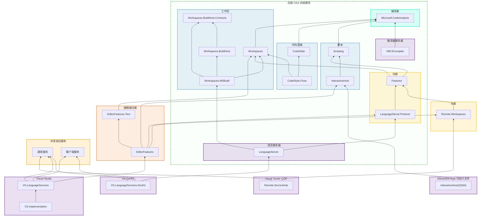

# Roslyn 架构 - 项目分层

箭头从项目指向其**所依赖**的项目（向上指向依赖项）。

```mermaid
graph BT

    subgraph OSS["仅限 OSS 的依赖项"]
        subgraph Layer0[" "]
            subgraph L0["编译器"]
                Microsoft_CodeAnalysis["Microsoft.CodeAnalysis"]
            end
        end

        subgraph Layer1[" "]
            subgraph L1a["工作区"]
                Microsoft_CodeAnalysis_Workspaces["Workspaces"]
                Microsoft_CodeAnalysis_Workspaces_BuildHost["Workspaces.BuildHost"]
                Microsoft_CodeAnalysis_Workspaces_MSBuild["Workspaces.MSBuild"]
                Microsoft_CodeAnalysis_Workspaces_BuildHost_Contracts["Workspaces.BuildHost.Contracts"]
            end

            subgraph L1b["代码风格"]
                Microsoft_CodeAnalysis_CodeStyle["CodeStyle"]
                Microsoft_CodeAnalysis_CodeStyle_Fixes["CodeStyle.Fixes"]
            end

            subgraph L1c["脚本"]
                Microsoft_CodeAnalysis_Scripting["Scripting"]
                Microsoft_CodeAnalysis_InteractiveHost["InteractiveHost"]
            end
        end

        subgraph Layer3[" "]
            subgraph L3a["功能"]
                Microsoft_CodeAnalysis_Features["Features"]
                Microsoft_CodeAnalysis_LanguageServer_Protocol["LanguageServer.Protocol"]
            end
        end

        subgraph L6b["语言服务器"]
            Microsoft_CodeAnalysis_LanguageServer["LanguageServer"]
        end

        subgraph L6e["编译器服务器"]
            VBCSCompiler["VBCSCompiler"]
        end
    end

    subgraph L3b["功能"]
        Microsoft_CodeAnalysis_Remote_Workspaces["Remote.Workspaces"]
    end

    subgraph Layer4[" "]
        subgraph L4["编辑器功能"]
            Microsoft_CodeAnalysis_EditorFeatures_Text["EditorFeatures.Text"]
            Microsoft_CodeAnalysis_EditorFeatures["EditorFeatures"]
        end
    end

    subgraph Layer5["共享经纪服务"]
        Brokered_Services_General["通用服务"]
        Brokered_Services_Client["客户端服务"]
    end

    subgraph Layer6[" "]
        subgraph L6a["Visual Studio"]
            Microsoft_VisualStudio_LanguageServices["VS.LanguageServices"]
            Microsoft_VisualStudio_LanguageServices_Implementation["VS.Implementation"]
        end

        subgraph L6c["Visual Studio OOP"]
            Microsoft_CodeAnalysis_Remote_ServiceHub["Remote.ServiceHub"]
        end

        subgraph L6d["Interactive Host 可执行文件"]
            InteractiveHost_Exe["InteractiveHost(32|64)"]
        end

        subgraph L6f["C# DevKit"]
            Microsoft_VisualStudio_LanguageServices_DevKit["VS.LanguageServices.DevKit"]
        end
    end

    Microsoft_CodeAnalysis_CodeStyle --> Microsoft_CodeAnalysis
    Microsoft_CodeAnalysis_CodeStyle_Fixes --> Microsoft_CodeAnalysis_CodeStyle
    Microsoft_CodeAnalysis_CodeStyle_Fixes --> Microsoft_CodeAnalysis_Workspaces
    Microsoft_CodeAnalysis_EditorFeatures --> Microsoft_CodeAnalysis_EditorFeatures_Text
    Microsoft_CodeAnalysis_EditorFeatures --> Microsoft_CodeAnalysis_InteractiveHost
    Microsoft_CodeAnalysis_EditorFeatures --> Microsoft_CodeAnalysis_LanguageServer_Protocol
    Microsoft_CodeAnalysis_EditorFeatures --> Microsoft_CodeAnalysis_Remote_Workspaces
    Microsoft_CodeAnalysis_EditorFeatures_Text --> Microsoft_CodeAnalysis_Workspaces
    Microsoft_CodeAnalysis_Features --> Microsoft_CodeAnalysis_Scripting
    Microsoft_CodeAnalysis_Features --> Microsoft_CodeAnalysis_Workspaces
    Microsoft_CodeAnalysis_InteractiveHost --> Microsoft_CodeAnalysis_Scripting
    Microsoft_CodeAnalysis_LanguageServer --> Microsoft_CodeAnalysis_LanguageServer_Protocol
    Microsoft_CodeAnalysis_LanguageServer --> Microsoft_CodeAnalysis_Workspaces_MSBuild
    Microsoft_CodeAnalysis_LanguageServer_Protocol --> Microsoft_CodeAnalysis_Features
    Microsoft_CodeAnalysis_Remote_Workspaces --> Microsoft_CodeAnalysis_Features
    Microsoft_CodeAnalysis_Remote_ServiceHub --> Microsoft_CodeAnalysis_Remote_Workspaces
    InteractiveHost_Exe --> Microsoft_CodeAnalysis_InteractiveHost
    VBCSCompiler --> Microsoft_CodeAnalysis
    Microsoft_CodeAnalysis_Scripting --> Microsoft_CodeAnalysis
    Microsoft_CodeAnalysis_Workspaces --> Microsoft_CodeAnalysis
    Microsoft_CodeAnalysis_Workspaces_MSBuild --> Microsoft_CodeAnalysis_Workspaces
    Microsoft_CodeAnalysis_Workspaces_MSBuild --> Microsoft_CodeAnalysis_Workspaces_BuildHost
    Microsoft_CodeAnalysis_Workspaces_MSBuild --> Microsoft_CodeAnalysis_Workspaces_BuildHost_Contracts
    Microsoft_CodeAnalysis_Workspaces_BuildHost --> Microsoft_CodeAnalysis_Workspaces_BuildHost_Contracts
    Microsoft_VisualStudio_LanguageServices --> Microsoft_CodeAnalysis_EditorFeatures
    Microsoft_VisualStudio_LanguageServices_Implementation --> Microsoft_VisualStudio_LanguageServices
    Microsoft_VisualStudio_LanguageServices_DevKit --> Microsoft_CodeAnalysis_LanguageServer
    Microsoft_CodeAnalysis_Remote_ServiceHub --> Brokered_Services_General
    Microsoft_VisualStudio_LanguageServices --> Brokered_Services_General
    Microsoft_VisualStudio_LanguageServices_DevKit --> Brokered_Services_General
    Microsoft_VisualStudio_LanguageServices --> Brokered_Services_Client
    Microsoft_VisualStudio_LanguageServices_DevKit --> Brokered_Services_Client

    style OSS fill:#e0ffe0,fill-opacity:0.15,stroke:#00aa00,stroke-width:2px,stroke-dasharray:5 5
    style Layer0 fill:none,stroke:none
    style Layer1 fill:none,stroke:none
    style Layer3 fill:none,stroke:none
    style Layer4 fill:none,stroke:none
    style Layer5 fill:orange,fill-opacity:0.15,stroke:orange,stroke-width:2px
    style Layer6 fill:none,stroke:none
    style L0 fill:#00ffc0,fill-opacity:0.15,stroke:#00ffc0,stroke-width:2px
    style L1a fill:#5b9bd5,fill-opacity:0.15,stroke:#5b9bd5,stroke-width:2px
    style L1b fill:#5b9bd5,fill-opacity:0.15,stroke:#5b9bd5,stroke-width:2px
    style L1c fill:#5b9bd5,fill-opacity:0.15,stroke:#5b9bd5,stroke-width:2px
    style L3a fill:#ffc000,fill-opacity:0.15,stroke:#ffc000,stroke-width:2px
    style L3b fill:#ffc000,fill-opacity:0.15,stroke:#ffc000,stroke-width:2px
    style L4 fill:#ed7d31,fill-opacity:0.15,stroke:#ed7d31,stroke-width:2px
    style L6a fill:#7030a0,fill-opacity:0.15,stroke:#7030a0,stroke-width:2px
    style L6b fill:#7030a0,fill-opacity:0.15,stroke:#7030a0,stroke-width:2px
    style L6c fill:#7030a0,fill-opacity:0.15,stroke:#7030a0,stroke-width:2px
    style L6d fill:#7030a0,fill-opacity:0.15,stroke:#7030a0,stroke-width:2px
    style L6e fill:#7030a0,fill-opacity:0.15,stroke:#7030a0,stroke-width:2px
    style L6f fill:#7030a0,fill-opacity:0.15,stroke:#7030a0,stroke-width:2px
```
